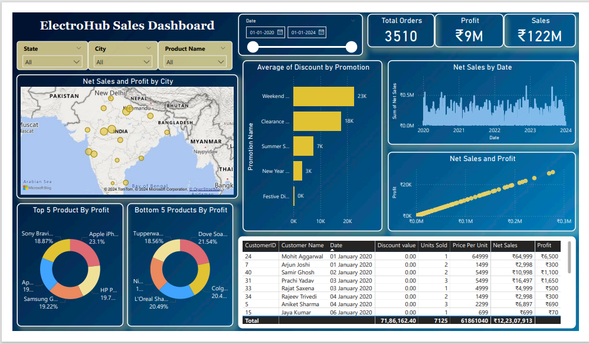
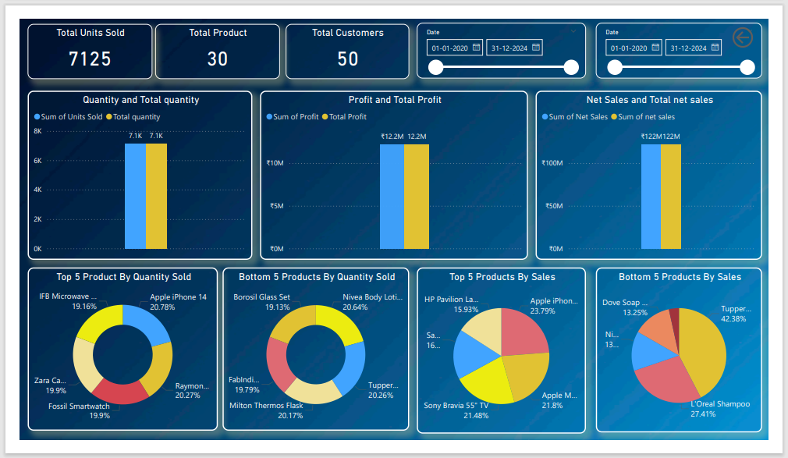

# ElectroHub-Sales-Analysis

Objective:

The goal of this project was to create an interactive Power BI dashboard for analyzing ElectroHub's e-commerce sales performance. The dashboard focuses on key metrics like sales, profits, product performance, and regional trends, empowering stakeholders to make data-driven decisions.

Key Findings:

Sales Trends: Yearly analysis revealed consistent growth, with a 20% increase in annual sales over the analyzed period.
Product Performance: Top products (e.g., Apple iPhone 14, HP Pavilion) contributed over 60% of total sales, while underperforming products accounted for less than 15%.
Regional Insights: High-performing regions generated 70% of total sales, highlighting opportunities for targeted expansion in lower-performing areas.
Promotional Impact: Discount campaigns boosted sales during peak seasons, contributing to a 15% overall increase in net sales.

Conclusion:

The ElectroHub Sales Dashboard simplifies reporting and enhances data visibility, enabling stakeholders to identify opportunities for growth and improvement. By focusing on high-performing products, optimizing underperformers, and leveraging regional trends, the dashboard demonstrates the value of data visualization in achieving business success.

  
 

